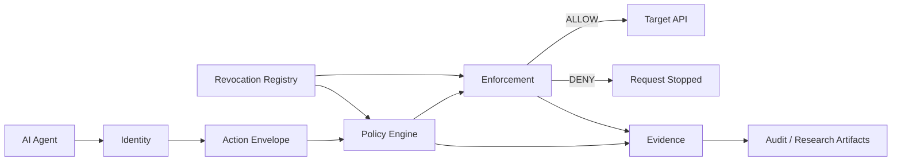

# Aether

### Authorization Control for Autonomous Software Agents

**IDENTITY → INTENT → AUTHORITY → ACTION → EVIDENCE**

Aether is an open-source authorization control and research platform for autonomous software agents.

It sits above workload identity and evaluates whether a **specific action**, by a **specific workload**, under a **specific context**, is authorized, enforceable, auditable, observable, and revocable.

> **Authentication answers: “Who are you?”**
> **Aether asks: “What are you allowed to do, here, now, and can that decision be enforced and evidenced?”**

---

## Why Aether?

AI agents are increasingly able to call APIs, access data, execute tools, modify systems, and trigger workflows.

A valid identity or credential does not by itself establish that every requested action is authorized.

Aether focuses on the control boundary between an agent and the privileged action it is attempting to perform.

```text
┌──────────────────────┐
│      AI AGENT        │
│  plan → request      │
└──────────┬───────────┘
           │
           ▼
┌────────────────────────────────────┐
│            AETHER                  │
│                                    │
│  IDENTITY                          │
│      ↓                             │
│  INTENT                            │
│      ↓                             │
│  AUTHORITY                         │
│      ↓                             │
│  ACTION                            │
│      ↓                             │
│  EVIDENCE                          │
└──────────────┬─────────────────────┘
               │
        ┌──────┴──────┐
        ▼             ▼
      ALLOW          DENY
        │             │
        ▼             ▼
    TOOL/API       NOTHING
        │
        ▼
     EVIDENCE
```

Aether does not attempt to determine whether an AI model is intelligent, correct, or trustworthy.

It evaluates whether the requested **action** satisfies the authorization policy and security controls defined at the enforcement boundary.

---

## Core Security Model

Aether is built around a narrow authorization chain:

```text
IDENTITY
   ↓
INTENT
   ↓
AUTHORITY
   ↓
ACTION
   ↓
EVIDENCE
```

The implementation currently includes boundaries for:

* workload identity
* deterministic policy evaluation
* action-envelope validation
* freshness checks
* anti-replay controls
* revocation
* reverse-proxy enforcement
* structured decision evidence
* adversarial testing

Established identity mechanisms are treated as an input to authorization rather than reinvented by Aether.

---

## What Aether Currently Demonstrates

The current repository contains a deterministic HTTP enforcement path, authorization policy engine, identity abstraction, revocation controls, evidence generation, and an Attack Lab / benchmark corpus.

Creator-controlled benchmark artifacts currently report:

**50/50 tested scenarios meeting their defined expected outcomes.**

This is a statement about the supplied test artifacts.

It does **not** mean:

* Aether is universally secure.
* All possible attack classes have been tested.
* No undiscovered vulnerability exists.
* The benchmark constitutes independent validation.
* The benchmark represents production security performance.

Independent validation is an explicit future objective.

---

## Attack Lab

### A reproducible challenge against the authorization boundary

Aether includes an adversarial test corpus designed to challenge the same enforcement path used for ordinary requests.

The purpose is not to produce a visually impressive security demonstration.

The purpose is to answer a narrower question:

> **When a request violates a defined authorization invariant, does Aether prevent that request from reaching the target?**

### Current tested corpus

The current benchmark artifacts cover **50 defined scenarios** across several security categories:

```text
┌─────────────────────────────────────────────┐
│              AETHER ATTACK LAB              │
├─────────────────────────────────────────────┤
│  Envelope Integrity                         │
│  Freshness                                  │
│  Identity Boundaries                        │
│  Method / Routing                           │
│  Policy Abuse                               │
│  Revocation                                 │
│  Input Boundaries                           │
└─────────────────────────────────────────────┘
```

Examples include:

```text
Missing identity
Missing intent
Missing capability
Missing target
Missing operation
Expired authorization
Future-issued authorization
Revoked identity
Revoked nonce
Wrong target
Wrong operation
Capability escalation
Near-miss target
Missing payload hash
```

### The important invariant

A denial response by itself is not enough.

For an unauthorized request, the expected enforcement property is:

```text
ATTACK
  │
  ▼
┌───────────────┐
│    AETHER     │
│               │
│  evaluate     │
│  authorize    │
│  enforce      │
└───────┬───────┘
        │
        ✕
        │
        ▼
     TARGET

Expected backend hits:
        0
```

For an authorized baseline request:

```text
REQUEST
   │
   ▼
 AETHER
   │
   ▼
 TARGET

Expected backend hits:
        1
```

This distinction lets the benchmark test whether the security boundary is actually enforcing the decision rather than merely reporting it.

### Current benchmark observation

The supplied creator-controlled benchmark artifacts report:

```text
50 / 50
tested scenarios
meeting their defined expected outcomes
```

The benchmark artifacts report blocked outcomes for the tested adversarial conditions and preserve the expected backend-enforcement behavior for the tested scenarios.

This observation is limited to the documented corpus and test environment.

It does **not** establish:

* universal attack coverage
* absence of undiscovered vulnerabilities
* production security
* independent validation
* security against attack classes outside the corpus

### How to reproduce it

Run:

```powershell
go test -count=1 -v ./cmd -run TestDay10Benchmark
```

Then inspect the resulting benchmark and evidence artifacts.

The project is designed so that another technical evaluator can inspect the methodology, scenario definitions, expected outcomes, observed results, and supporting artifacts rather than relying on a headline number.

### Break the assumption

Aether is intentionally built to be challenged.

A useful security finding is not treated as a failure of the research process.

A confirmed bypass should become:

```text
finding
   ↓
reproduction
   ↓
regression test
   ↓
fix
   ↓
new benchmark
   ↓
documented correction
```

That feedback loop is part of the project's research model.

### Evidence boundary

Current Attack Lab results are **creator-controlled test evidence**.

Independent reproduction, independent security review, external contributors, and organizational evaluation are separate evidence categories and are not implied by the benchmark result.

---

## Evidence

Aether treats evidence as part of the security design rather than an afterthought.

Decision records can capture structured information about:

* identity
* requested intent
* capability
* target
* operation
* policy rule
* decision
* reason
* request information
* timestamps
* request identifiers
* integrity hashes
* revocation state

The evidence layer is intended to make authorization decisions inspectable and reproducible.

The UI is not the source of security truth.

The underlying server-side decision and evidence records remain authoritative.

---

## Architecture



### Major components

| Component   | Purpose                                           |
| ----------- | ------------------------------------------------- |
| Identity    | Establish workload identity                       |
| Envelope    | Validate the requested action                     |
| Policy      | Produce deterministic authorization decisions     |
| Revocation  | Remove authority when required                    |
| Enforcement | Prevent unauthorized requests reaching the target |
| Evidence    | Preserve structured decision records              |
| Attack Lab  | Challenge defined security invariants             |
| Benchmark   | Produce reproducible machine-readable results     |

---

## Quickstart

### Requirements

* Go
* Git
* A local development environment

Clone the repository:

```bash
git clone https://github.com/YabulHaj/Aether-Protocol.git
cd Aether-Protocol
```

### Run the test suite

```bash
go test ./...
```

### Build

```bash
go build ./...
```

### Local development mode

Aether supports an explicit mock identity mode for local development.

**PowerShell:**

```powershell
$env:AETHER_IDENTITY_MODE="mock"
go run ./cmd
```

The mock identity provider is intended for local development and testing.

It is **not a production identity configuration**.

### Benchmark / Attack Lab

The benchmark harness can be executed with:

```powershell
go test -count=1 -v ./cmd -run TestDay10Benchmark
```

Generated results should be treated according to the repository's evidence classification and methodology.

---

## Security Boundary

Aether is intentionally narrow.

It does not claim to:

* secure an AI model itself
* determine whether a model's reasoning is correct
* replace workload identity systems
* replace general-purpose IAM
* eliminate application vulnerabilities
* eliminate prompt injection
* guarantee agent safety
* guarantee production security

Aether instead focuses on the authorization and enforcement boundary surrounding autonomous software actions.

---

## Research Questions

The project investigates questions such as:

1. Can autonomous-agent actions be evaluated using deterministic authorization rules rather than identity alone?

2. Can unauthorized agent actions be prevented from reaching their target?

3. Can authorization decisions be recorded as structured, integrity-verifiable evidence?

4. Can stale, replayed, revoked, malformed, or out-of-policy actions be rejected consistently?

5. Can the resulting security experiments be independently reproduced?

6. Where are the limitations and bypasses of this model?

The project treats discovered weaknesses as research inputs.

A confirmed bypass should become a regression test whenever technically appropriate.

---

## Current Limitations

The current implementation remains a research / validation platform rather than a claim of production completeness.

Known limitations include areas such as:

* creator-controlled rather than independently reproduced benchmark results
* local development identity mode
* process-local revocation state
* incomplete production-scale deployment validation
* incomplete end-to-end SPIFFE/SPIRE validation
* evolving live telemetry / visualization infrastructure

These limitations are part of the research record.

---

## Reproducibility

The project is designed so that an unfamiliar technical evaluator can:

1. obtain the repository;
2. follow the Quickstart;
3. execute the test suite;
4. execute the benchmark;
5. inspect the policy decisions;
6. inspect evidence artifacts;
7. reproduce defined scenarios;
8. compare observed behavior with documented expectations.

The goal is not simply to demonstrate that Aether works.

The goal is to make it possible for another technical person to determine **what actually happened**.

---

## Contributing

Security findings, reproducibility reports, technical review, integrations, and improvements are welcome.

Aether is particularly interested in:

* bypass research
* authorization edge cases
* reproducibility
* security testing
* identity integration
* benchmark methodology
* evidence integrity
* independent evaluation

When reporting a security weakness, provide enough technical detail to reproduce the behavior safely.

---

## Security

Please do not disclose sensitive vulnerability details through ordinary public issues when responsible disclosure is more appropriate.

See the repository security policy for the current reporting process.

---

## Status

Aether is an active open-source security research project.

The project prioritizes:

**reproducibility over hype,**

**evidence over assertion,**

**independent validation over self-description,**

and

**measurable security behavior over visual demonstration.**

---

## License

See `LICENSE`.

---

## Research Principle

> **No action without authorization.
> No authorization without context.
> No security claim without evidence.**
